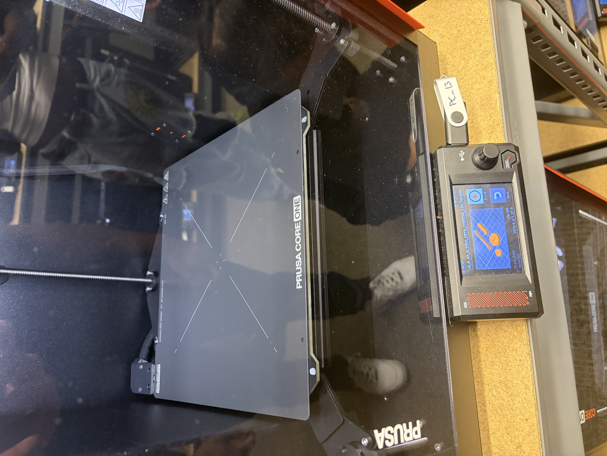

# A2 – 

**Independent Research: DFAM**  
When designing for Additive Manufacturing it is important to choose precise wall thickness measurements, considering both the material and the restrictions of the specific printer used. This is important because overly thin walls do not enough support as the layers of material are added, and otherwise, would allow for warping.

*Source:*  
- (https://avidpd.com/additive-manufacturing/design-for-additive-manufacturing-5-rules-every-engineer-should-know/)
   
**Independent Research: FDM**  
When FDM printing, one specific consideration that must be kept in mind is thermal warping. This is when the intended dimensions and design of a print deform due to uneven cooling. To accommodate this issue, a user could install a heating system to the build plate or allow all cooling to happen inside the machine, allowing for little to no or controlled cooling.  

*Source:*  
- https://www.3dmag.com/3d-wikipedia/3d-print-warping-causes-and-fixes/  
   
# Print Something Small    
  
## Download     

  

- For my small print I chose a small Mario Coin toy model. I chose this because it connects to something I and my younger siblings enjoy, so it is useful beyond this class. In comparison to designs I considered, it fit into the dimension and time constraints as well with a short height and small diameter.
    
     
   
- Above is the first design I considered, one I believed would also hold its use beyond this class. However it surpassed the dimension restraints in height and would need to be scaled down, rendering it useless as a functional cable holder.  
  
   
  
- The last design I considered before my final decision ultimately guided my search in the right direction. Although I would not have a use for it, I considered this coin model because it was a basic model that fit within all the restrictions. Almost immediately, it led me towards the end print chosen.  
  

## Preprocessor    
   
For my group, the only difficulties of the slicing and scaling process was in sharing the files with one another due to WIFI issues at the time. Otherwise, three out of the four models chosen were under the .25 inch height limit and all were within a 2 inches by 2 inches area. The print that surpassed the limit was easily scaled down by adjusting the z-axis restraints to match the assignment stipulations.     
    
  
  
*Displayed Above: Model Resizing*  
    
The build orientation chosen was to put the individual parts as close together as possible without overlapping boundaries or interference. No supports were necessary for this print as well, making it an overall smooth process.  
    

   
*Displayed Above: Slicer Information*  

## Print
For this assignment Jack Welch, Ethan Minton, Nicholas Brady, and I joined together using one printer. The initial pre-heating stages took around 20 minutes or so to complete and were tracked via the displayed percentages on the printers screen.
  
Once the preheating completed, the start screen presented, showing the print time at 13 minutes and 20 seconds. Our parts were printed using PETG/4 which was loaded into the printer before we arrived. 
  
*Displayed Above: Start Screen*  

The start button was pressed, the printer began the probing process which around a minute to complete, and then material began to be applied to the board.  

  
*Probing Video:*  
- https://drive.google.com/file/d/1oM7a1CG6C5GJpG7Mg9u2eAY7eiwPB2If/view?usp=sharing

    
After the printing process began, technical issues did as well. The mechanism within the printer that pulls the PETG filament into the nozzle was getting caught making the filament too taut and resulting in a warped first print. The inconsistency of the filament was clear in the early stages of printing, so the process was ended short.  
  
  
*First Print Attempt Video:*  
- https://drive.google.com/file/d/19rmCVeRXJQ--H5WdXHvuPhpEQJdKLVz9/view?usp=sharing

     
The filament was removed and the printing process was restarted, resulting in a clean print this time around. The print took a total of 18 minutes and 24 seconds to complete, as seen on the display screen.    
  
  
  
  

*Displayed Above: A successful print!*

*Successful Print Video:*  
- https://drive.google.com/file/d/1yYRTucWjNqt6fyvwtHBTRuUta0dvB_VC/view?usp=sharing
  

