# A3 – [Topic]

## Objective
Design a small object, develop preprocessor skills, and 3D print the designed item.
  
  
## Design
For my design, I chose to create a cat stamp meant to be used alongside an inkpad. This came to mind because of a personal art project involving ink within the past week. When considering the design, it seemed achievable within the parameters while still having an amount of practical use.
  
To start the stamp, I began with a base rectangle below the 1.5 in by 1.5 in parameter on the top plane. Once this base was extruded, seen as BlockExtrude, I began experimenting with the design of the stamp on the top exposed surface of the block. 
  
I chose to center the rectangle on the origin allowing the circle and triangles making up the cat face to remain centered as well. Once the head was created, whiskers were added and the shape itself was extruded.
  
The largest challenge of this design was continually dimensions of the details to ensure the final face would be legible in print. This was tested by comparing the metrics inputted to a ruler in hand. Eyes were represented in this design by a rhombus geometry and a heart shape for the nose. 

**Visuals:**
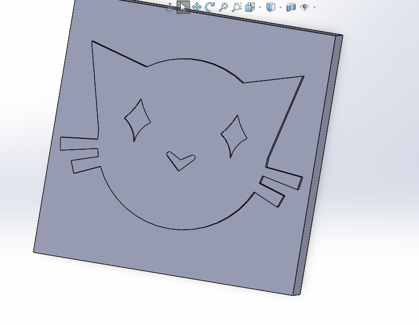
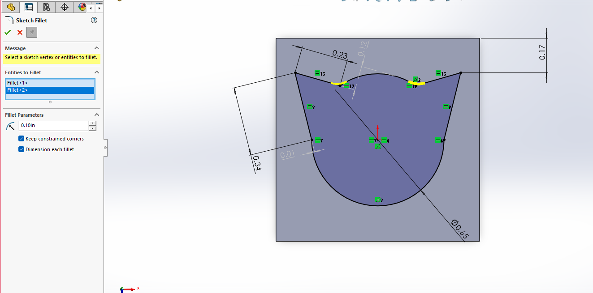
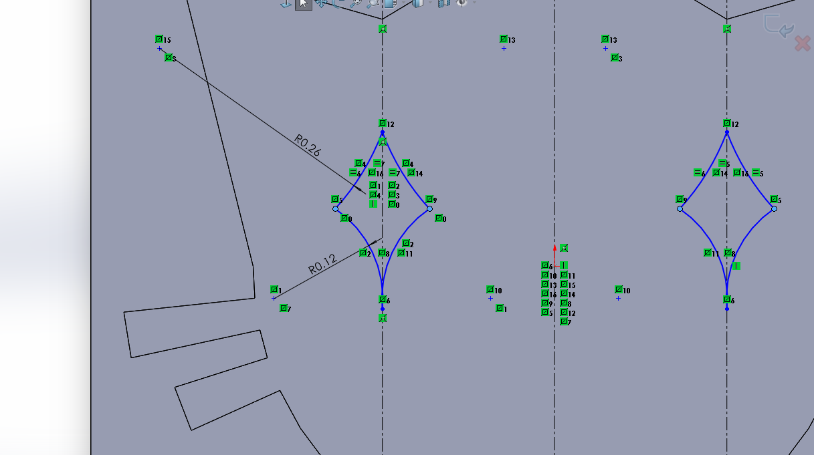

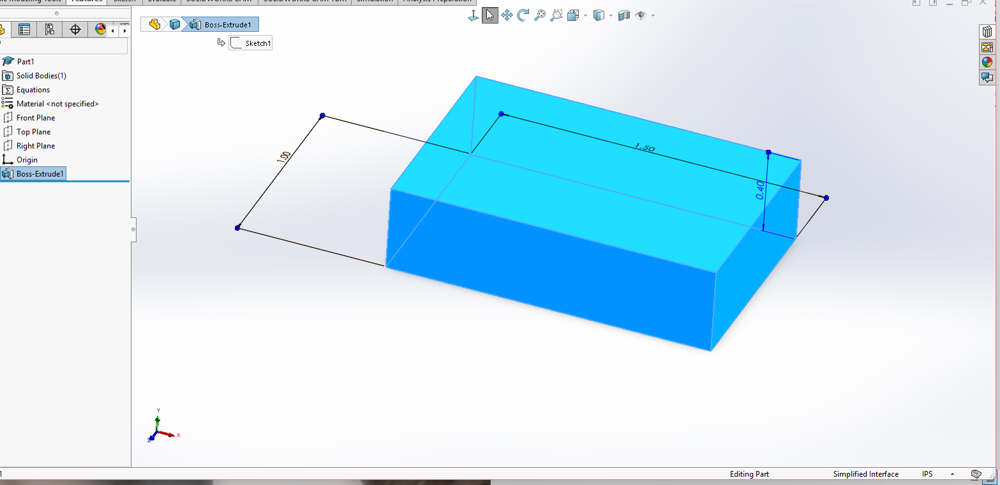
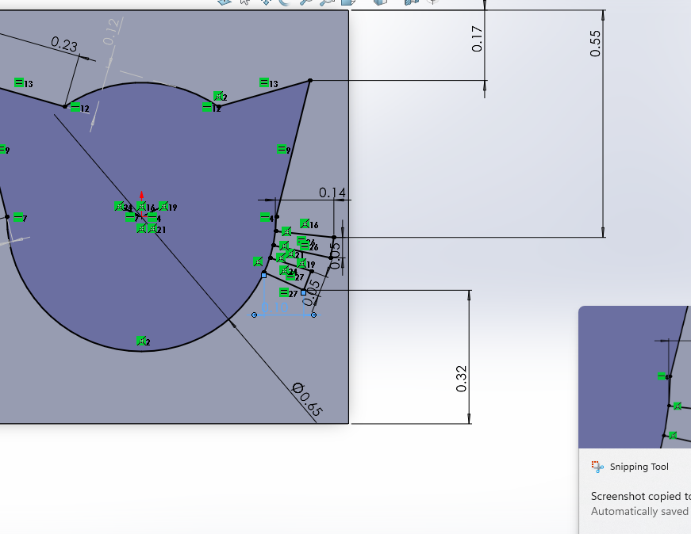

## Research
  
**Gyroid**  
This infill lacks straight line, making continuous twists out of the material. This design allows the infill to create parts with high strength and durability from multiple directions. 
  
**Grid**
This infill is made up of straight lines crossing each other creating a cubic pattern in each layer. A motivation of using this infill is that it allows vertical strength and quick part prints.
  
**HoneyComb**
This infill is made up of a collection of aligned hexagons, mimicking honeycomb found in nature. The design is both lightweight while still providing high strength, particularly in resistance to vertical compressive force.
   
**Resources:**  
- https://www.simplemachining.com/blogs/understanding-3d-printing-infill-for-better-part-design
- https://www.simplemachining.com/blogs/understanding-rectilinear-vs-grid-infill-for-3d-printing
- https://help.prusa3d.com/article/infill-patterns_177130
- https://bigrep.com/posts/gyroid-infill-3d-printing/
    
## Preprocessor and Printing
In the CAD model of my design, all parameters were considered in the final dimension choices, and therefore, it did not need to be scaled to begin preprocessing. Although the default infill for this design was Cubic, through the research cited above, I discovered Gyroid would prove a better fit for the use of the part. When using a stamp, compressive force may be applied at multiple directions, so to avoid failure it is necessary to choose an infill known for its strength, fitting the unique benefits of Gyroid infill.

I chose to only infill to 50% density, because Gyroid can become costly in time as density increases. To supplement any strength lost from a mid-filled part, I chose to use 5 Top solid layers, adding more stability to the side of the stamp with the design. Wall thickness can contribute to stiffness as well as increased, so a higher choice works well for this model.  

**Visuals:**  
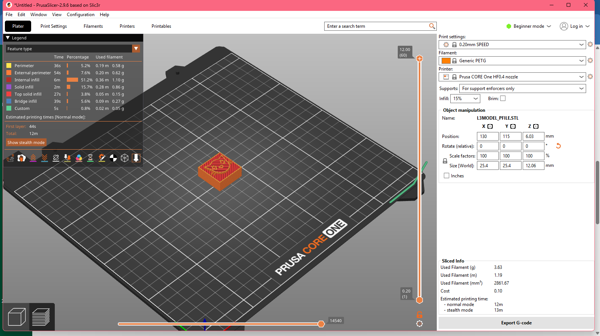

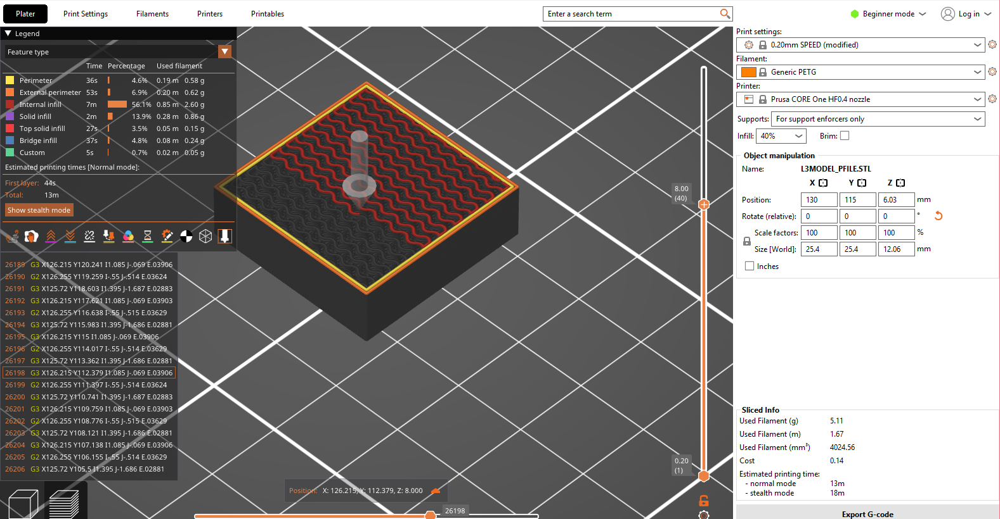

## Print
**Final Result:**
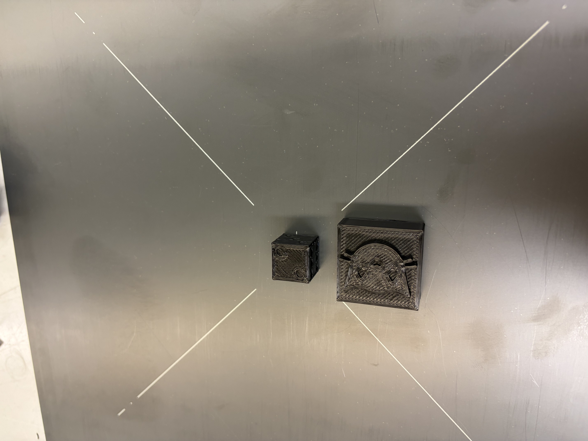

**Machine Start Up:**  
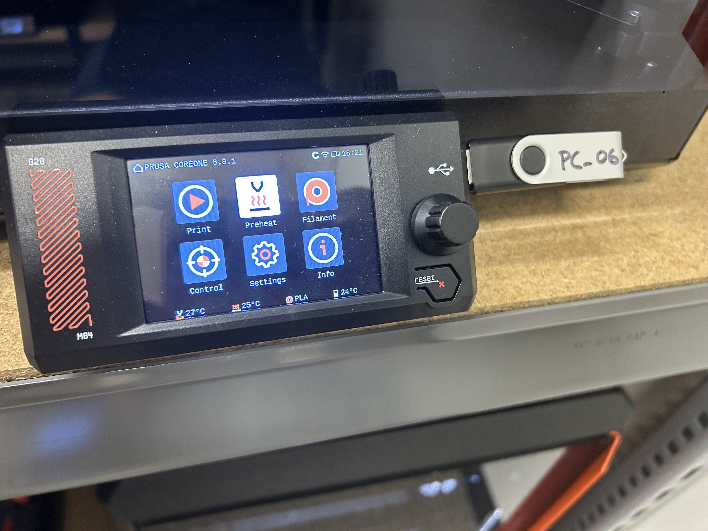
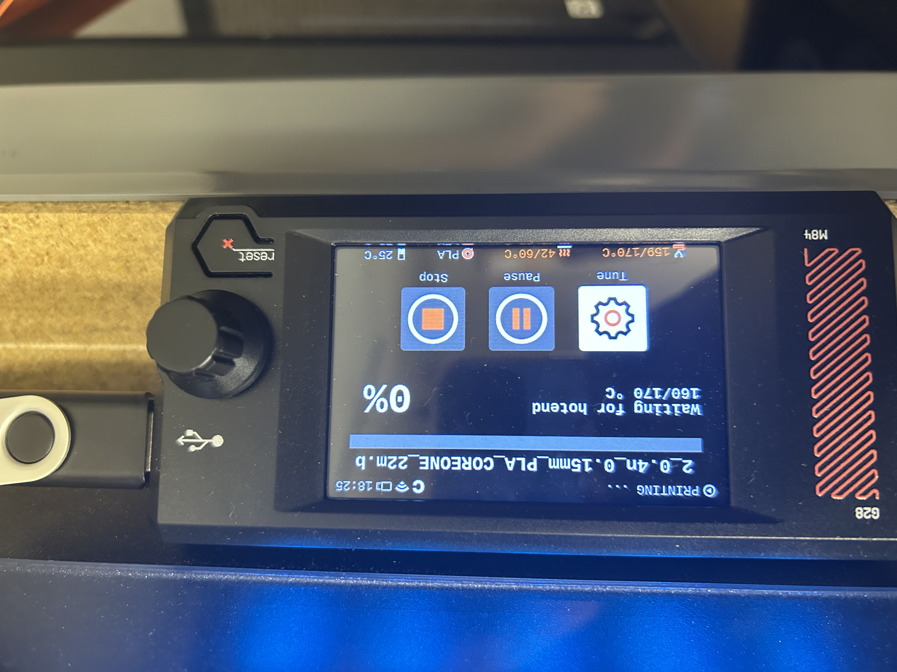
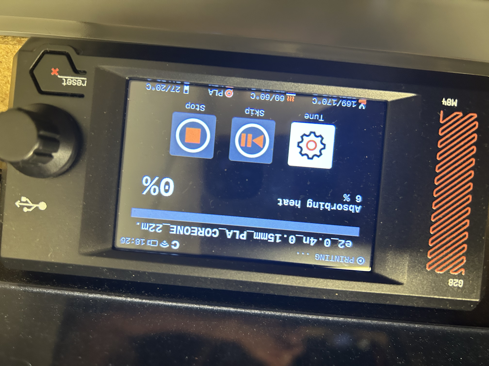  

  
**Print Photos:**
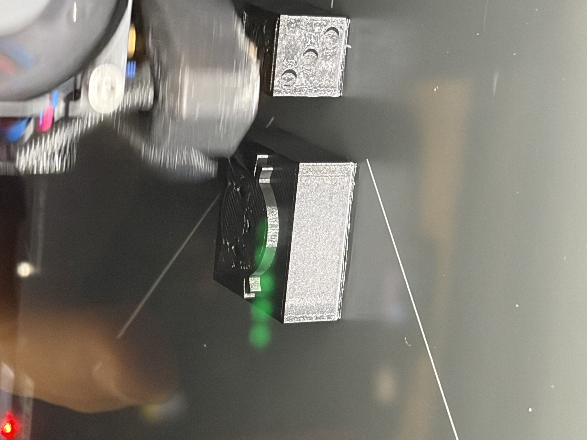
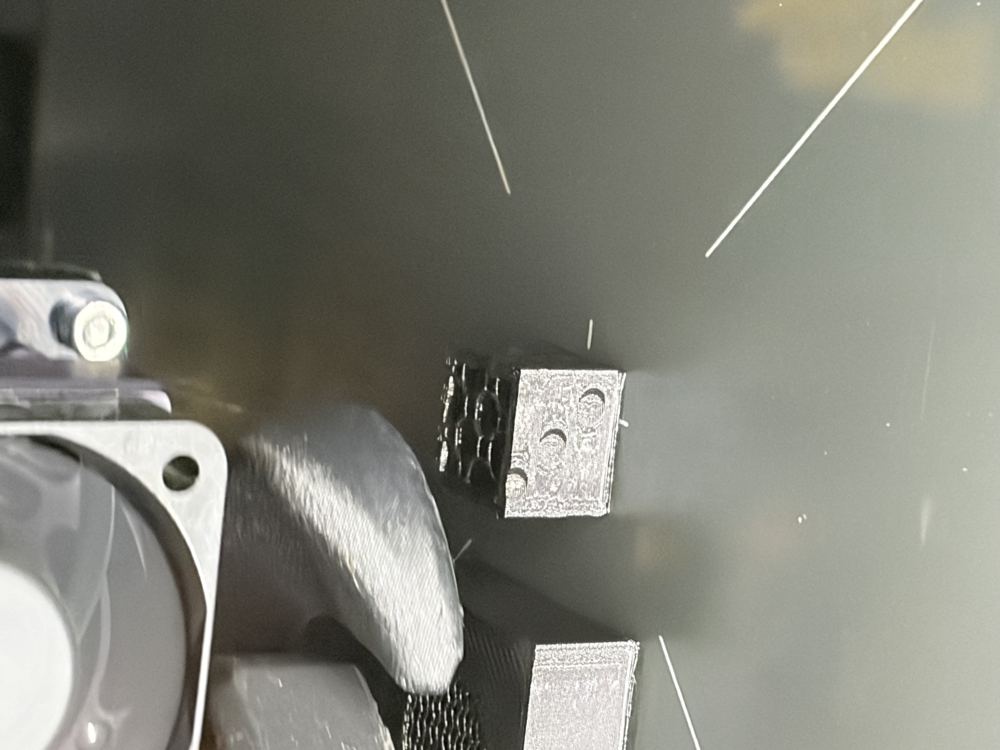
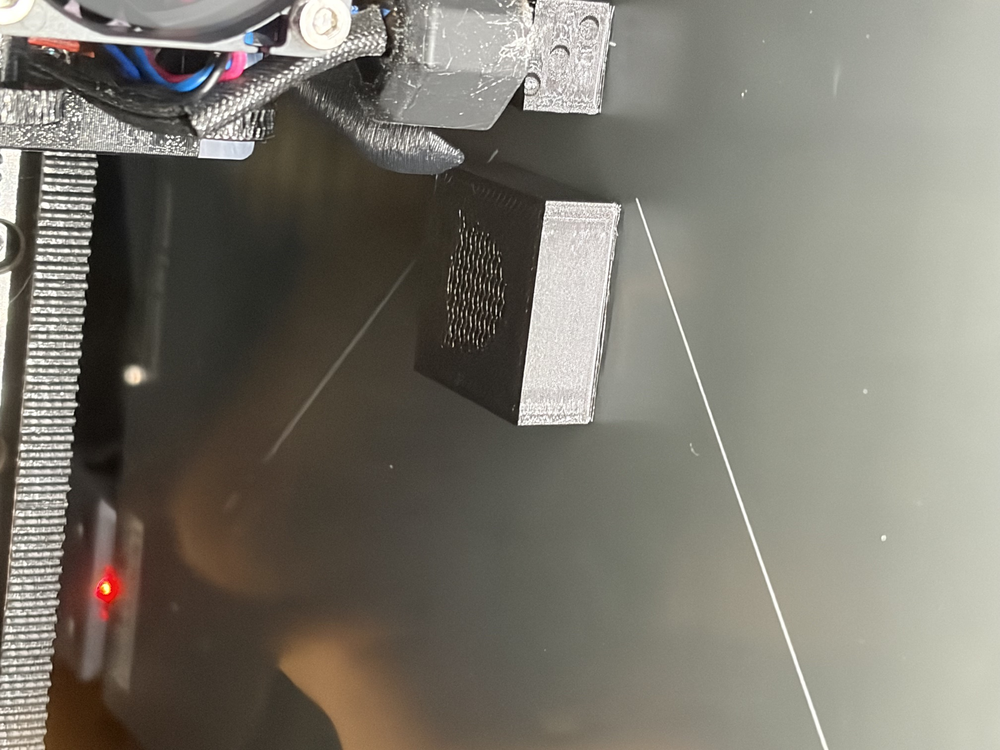  
*Above, the infill of each part is visible.*  

**Watch the Print:**  
https://drive.google.com/drive/folders/1CIdHzi_jBhkrCriRWBUuGC-s06_ir8tu?usp=drive_link 

## Lessons Learned  

This project was my first time designing, preprocessing, and printing a part of my own. Throughout the process I learned that abiding by dimension restrictions and determining part use early lays the foundation for understanding the steps needed to create a part. This project took me around 7-8 hours to complete.
