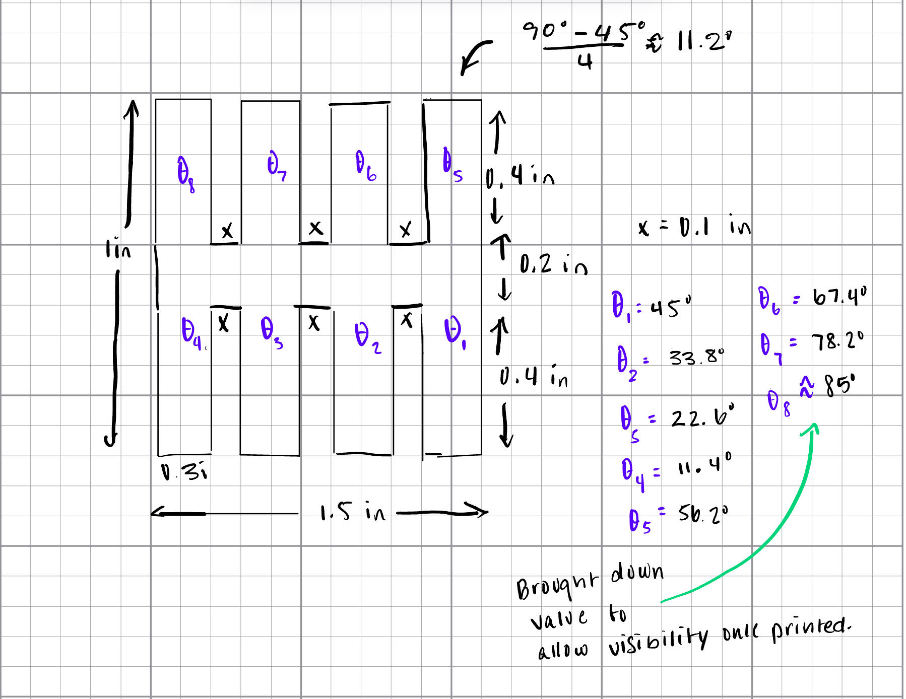
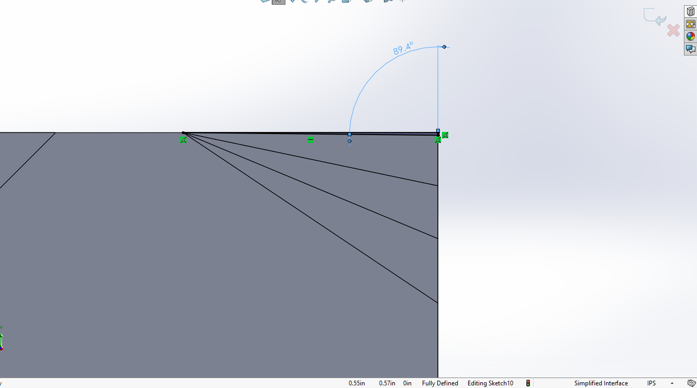
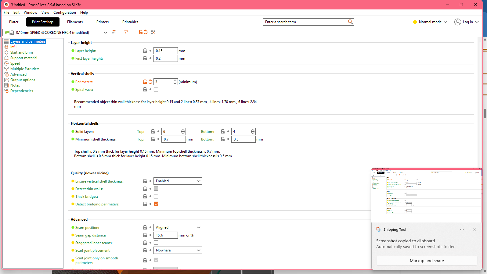
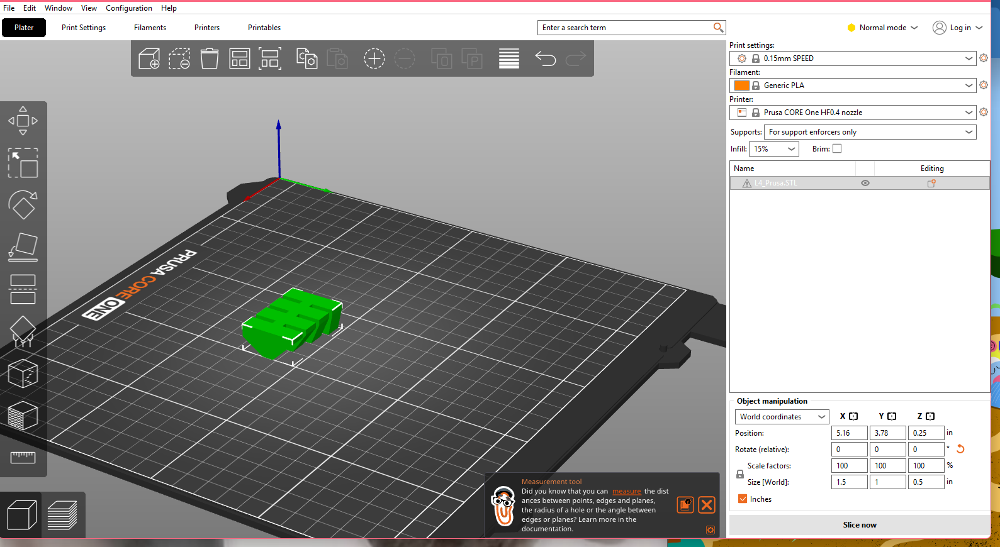
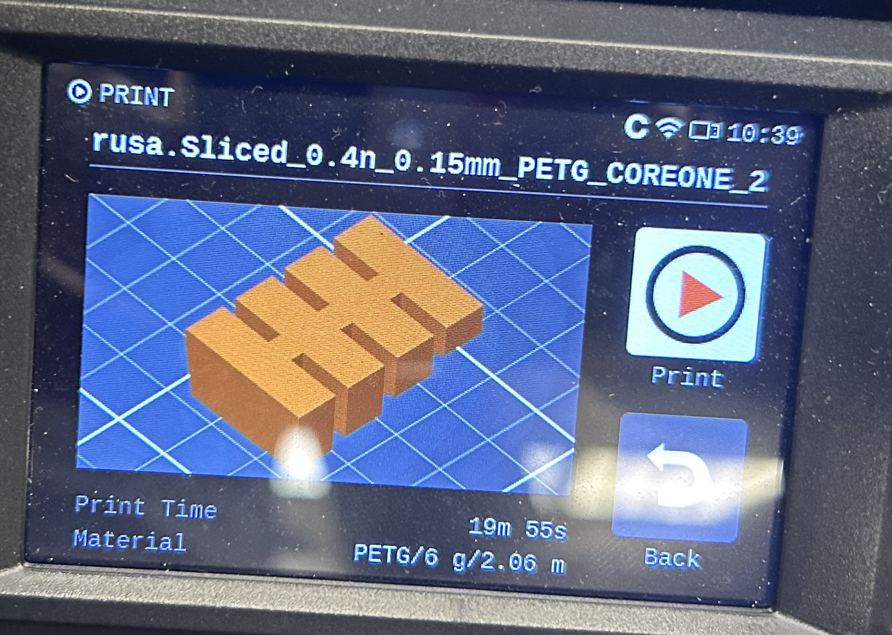
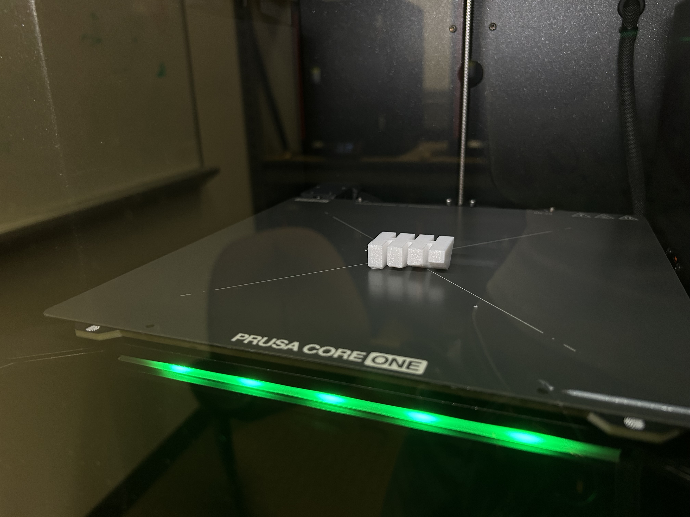
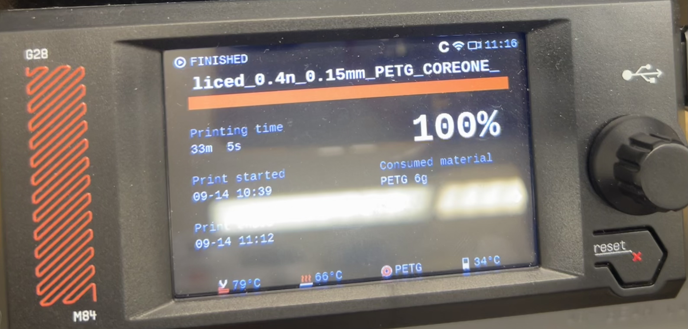
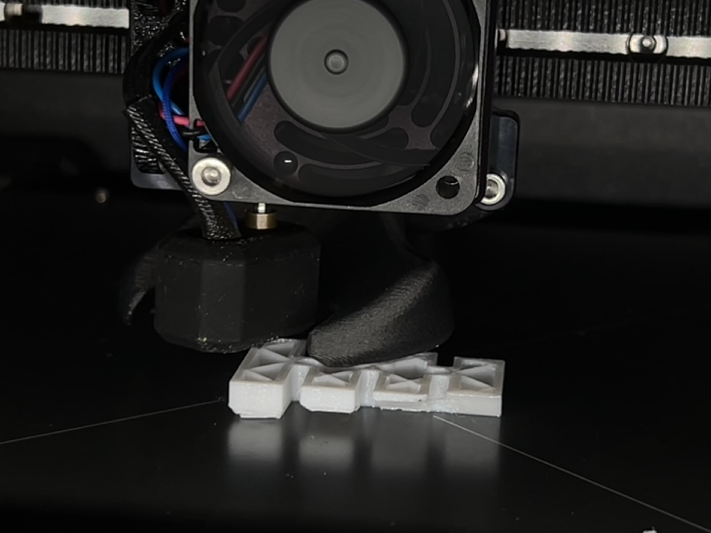

# A4 – Benchmark a Parameter

## Parameter
This week, I am designing an benchmark artifact testing the overhang limits of the Prusa Core One. I predict the print will start to see Overhang failure at angles increasing past 45°.
  
## Document Design & Preprocessor  

To start my design, I began with a drawing of the basic Top View Geometry. I chose to use basic shapes in this design so it would be easier to demonstrate multiple levels of failure on the same artifact.   
From this decision, I decided it would be best to intend to have failure angles (angles above 45°) on one side of the artifact, while having increasing stable angles from 45° on the other. I believe this gives the part a cleaner presentation as well, because all sagging and stringing should isolate to the failure side.   
   
To find the difference between each angle from 45°, I used the following formula:   
  
**(90° - 45°)/(# of legs on one side) = Approximate angle difference**  
  
The exception to this formula is the highest angle in the model. I decided to decrease the originally planned 89.4° to 85°, as I was concerned that there would be no visible difference between this angle and 90°.  
  
*Calculations*  
  

    
***Initial Sketch***  
   
Once the basic geometry, dimensions, and angle estimates were decided, I began translating the sketch to SolidWorks. I free-sketched the shape, coincident to the origin, and input my chosen dimensions into one over hang extension. I used relations to align the CAD sketch with my initial design and extruded the sketch.  
    
         
  
***Angles***   
  
As per the above design, angles were distributed with increasing angles past the expected limitation of 45° on one side, and decreasing on the other. Angles were sketched as right triangles on the face of the overhang extensions to follow the pattern of simple geometry used. 
  
   
                      
  
***Angle Cuts***  

Each angle was carved out using the Cut Extrude tool.  
  
               
  
***Final Artifact Sketch***  
  
  

***Preprocessor Research***   
In consideration of benchmarking the Prusa Core One angle parameter, I wanted all preprocessor parameters to promote successful printing while still allowing visible overhang failure in the artifact. Through research documented in the Resources section below, I determined wall thickness was the most important parameter to adjust to meet this goal. I chose to increase the wall thickness by using 3 vertical shell perimeters. My intention was to increase stability to eliminate it as a potential cause of the sagging typically seen.
  
    
  
Additionally, I decreased infill density to 10% with the same goal in mind. In an attempt to prevent any other error, I kept the PrusaSlicer recommended layer height for the model. I was unable to find any evidence that a specific infill pattern would affect the results of this particular test, so I chose to keep the recommended pattern as well. The system recommended a grid infill, as it is common for low density parts.
  
 
  
## Print Artifact
I printed my benchmark artifact in General PETG with an estimated printing time of around 20 minutes and an actual printing time of 33 minutes. 
  
**Watch it Print:**  https://drive.google.com/drive/folders/11TTlk8jCx9OiNJc9GAkbGBhsE6BrRDSS?usp=sharing 
  
**Other Visuals from Print:**  
  
        
  
*Close Up of Infill Design -*  
  
  
## Lessons Learned  
Overall, the outcome of my artifact was the same as I hypothesized, as failure was isolated the side of the artifact with angles larger than 45°. Through the process I was able to gain a further understanding of preprocessor parameters, specifically the connection between overhangs and wall thickness. In the future, I now know that increasing perimeters is wise when attempting to avoid overhangs while printing without supports.

In the success of my artifact I found that another helpful lesson to take forward is to consider all aspects of the preprocessing step in relation to each other. This meant I didn't eliminate the affects of one change through another. When it came time to print, research informed me that PETG would be successful to demonstrate this type of failure, as it is known for poor overhangs. Lastly, if done again, I may have scaled up this print to demonstrate this further. 

This assignment in total took between 4 to 5 hours to complete.
  
## Resources
  
- https://help.prusa3d.com/article/modeling-with-3d-printing-in-mind_164135
- https://help.prusa3d.com/article/petg_2059
- https://help.prusa3d.com/article/infill-patterns_177130
- https://bigrep.com/posts/optimizing-layer-height-3d-printing/
- https://www.raise3d.com/blog/infill-3d-printing/#infill-density
- https://3dplatform.com/blogs/blog/printing-overhangs-beyond-45-degrees
- https://www.microcenter.com/site/mc-news/article/overhang-test.aspx
  

