# A4 – Benchmark a Parameter

## Parameter
This week, I am designing an benchmark artifact testing the overhang limits of the Prusa Core One.  
  
## Document Design & Preprocessor
To start my design, I began with a drawing of the basic Top View Geometry. I chose to design for an 
  
*Insert pictures from ipad*  
  
***Initial Sketch***  
  
Once the basic geometry, dimensions, and angle estimates were decided, I began translating the sketch to SolidWorks. I free-sketched the shape, coincident to the origin, and input my chosen dimensions into one over hang extension. I used relations to align the CAD sketch with my initial design and extruded the sketch.  
   
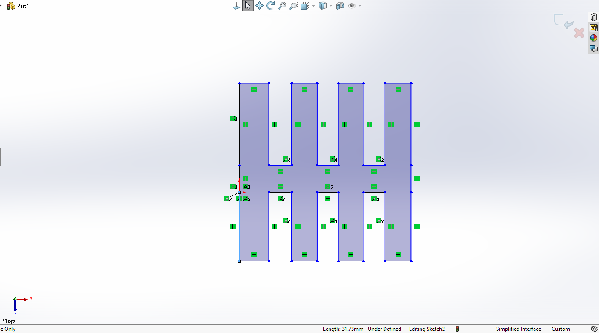  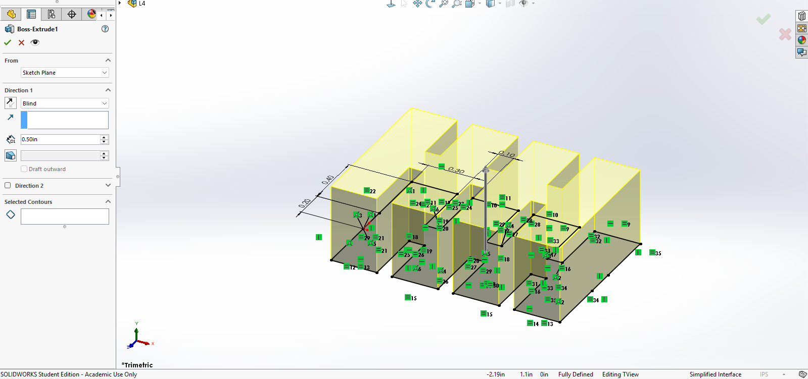  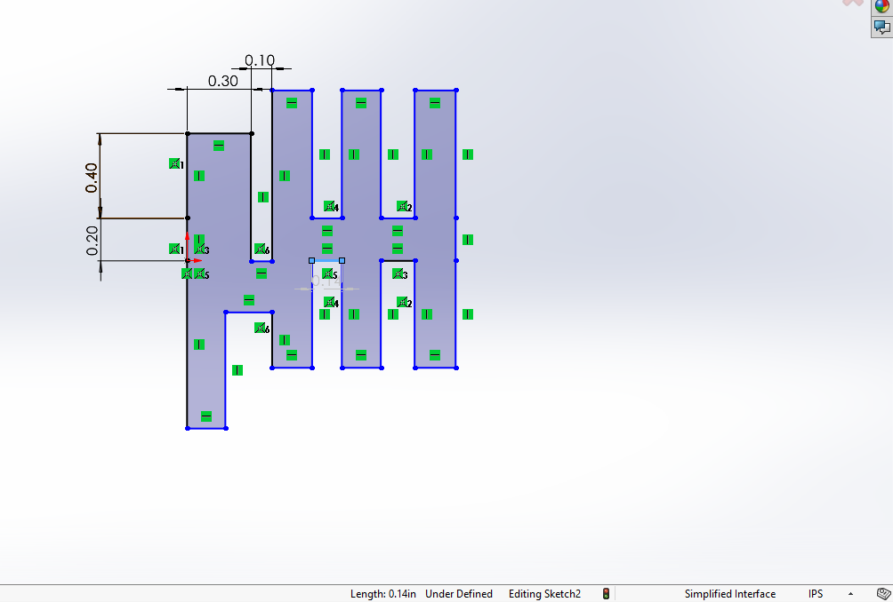  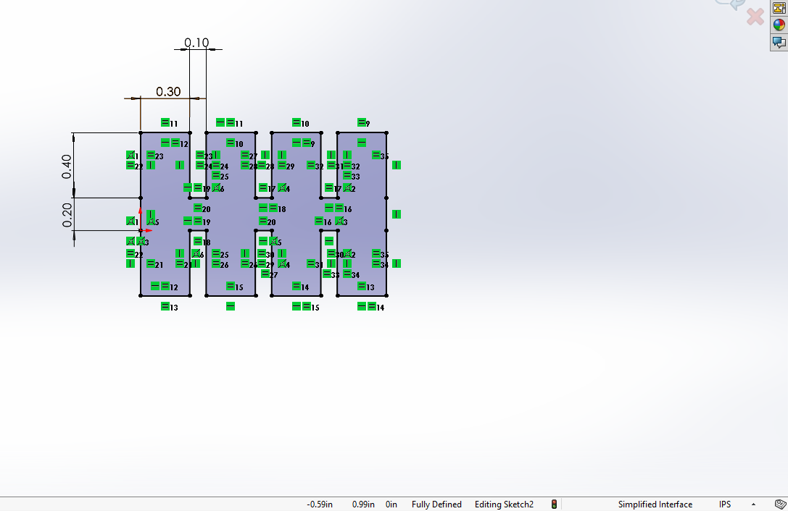   
  
***Angles***   
  
As per the above design, angles were distributed with increasing angles past the expected limitation of 45° on one side, and decreasing on the other. Angles were sketched as right triangles on the face of the overhang extensions.  
  
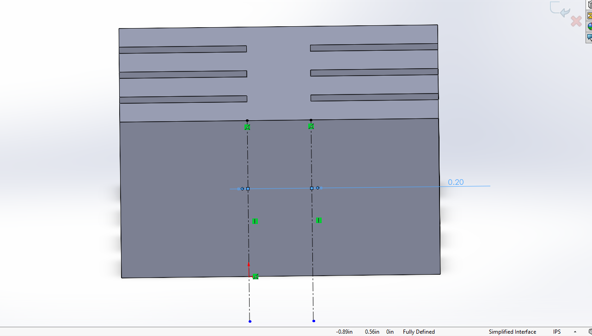   
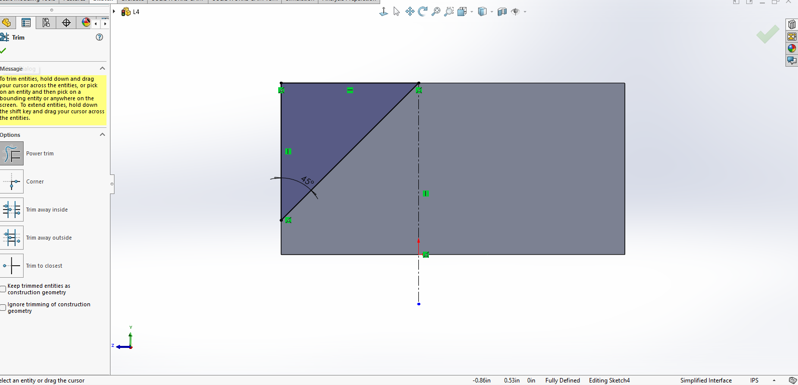  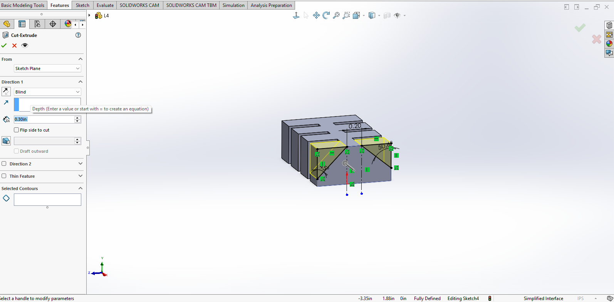  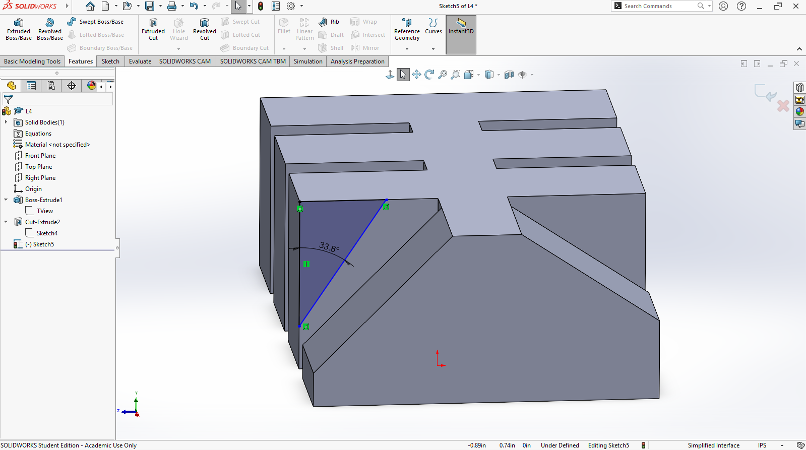  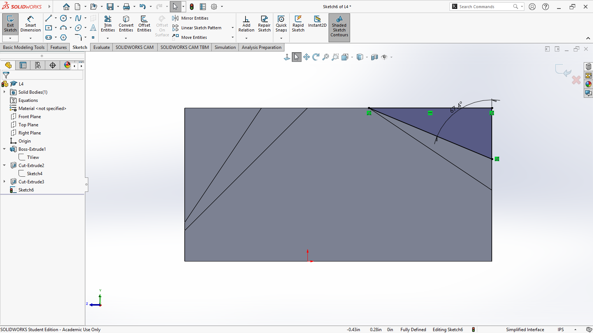   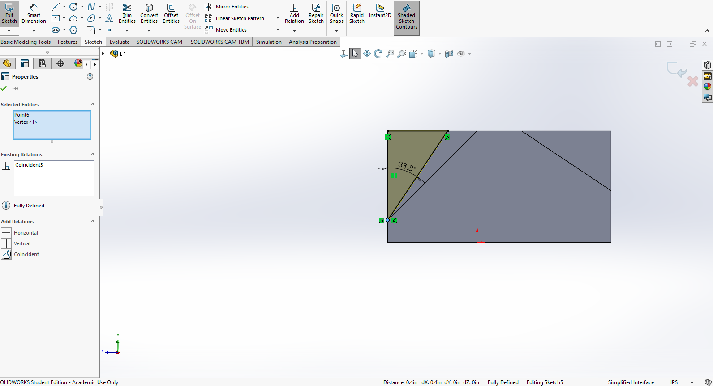   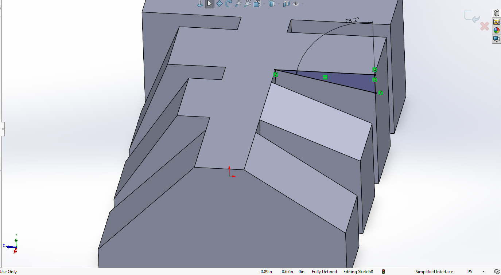   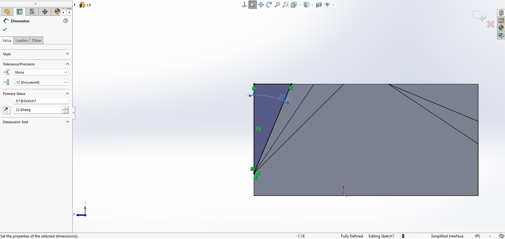    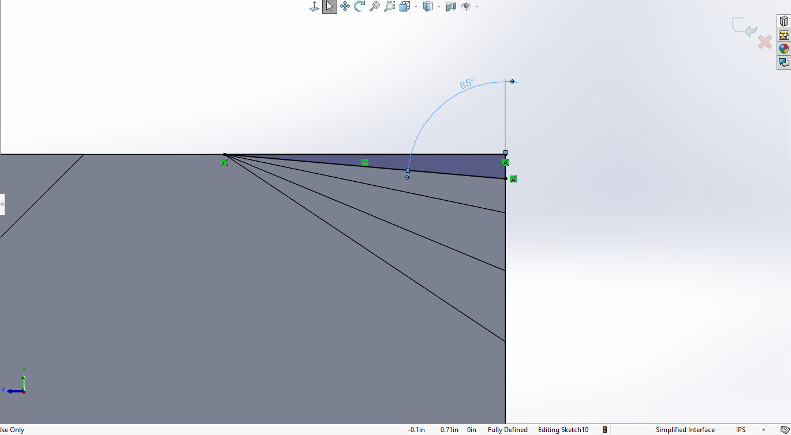   
  
***Angle Cuts***  

Each angle was carved out using the Cut Extrude tool.  
  
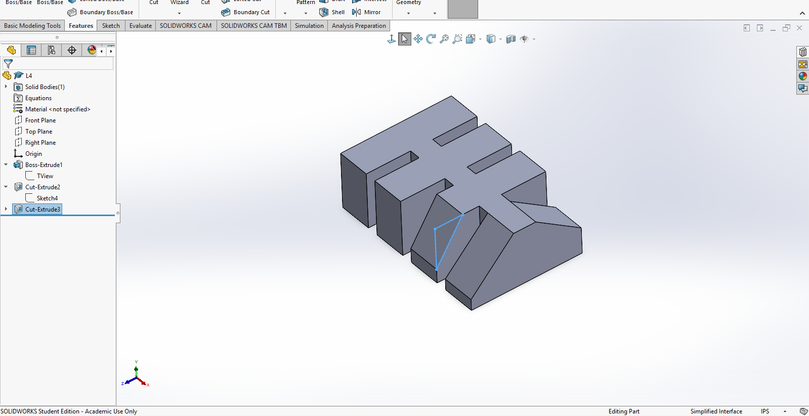  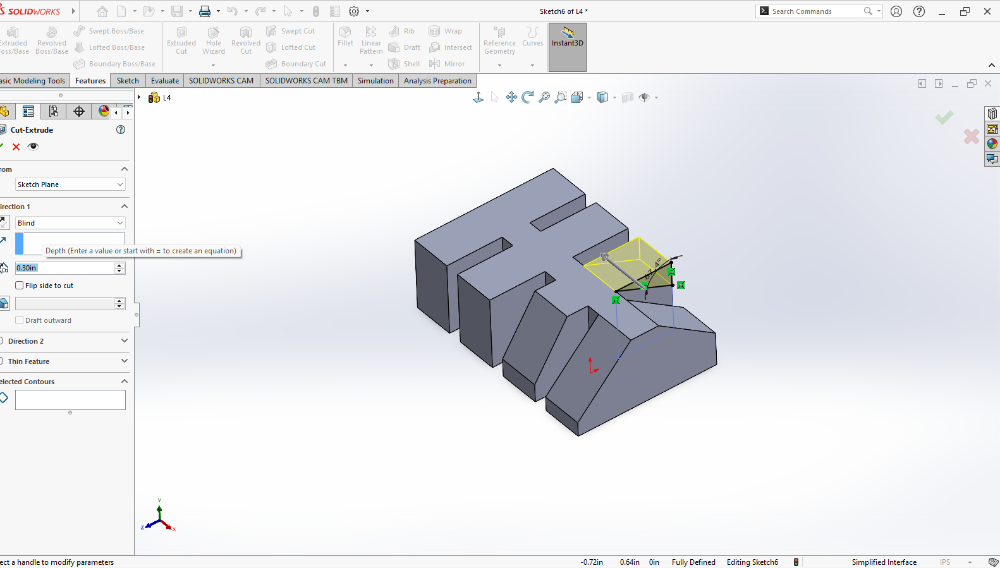  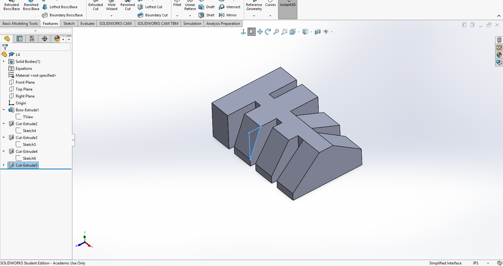  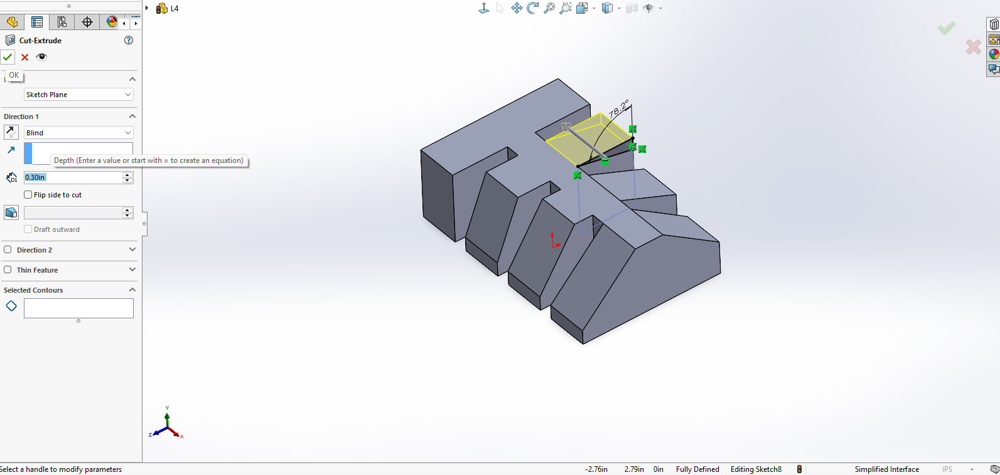   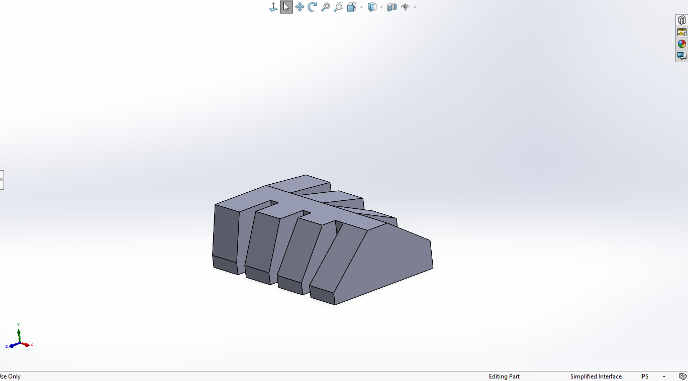      
  
***Final Artifact Sketch***  
  
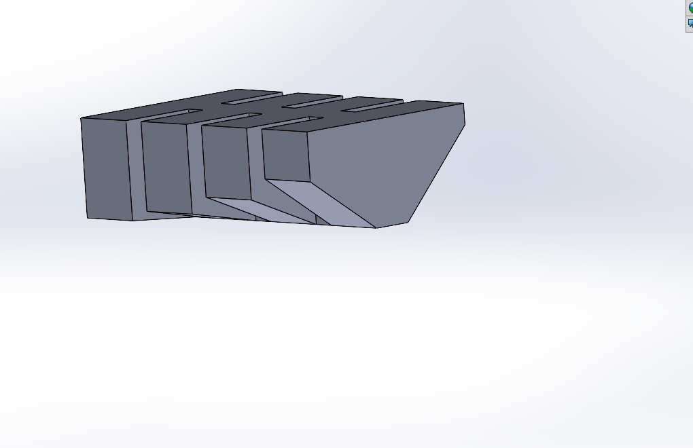  

***Preprocessor Research***
In consideration of benchmarking the Prusa Core One angle parameter, I wanted all preprocessor parameters to promote successful printing while still allowing visible overhang failure in the artifact. Through research documented in the Resources section below, I determined wall thickness was the most important parameter to adjust to meet this goal. I chose to increase the wall thickness by using 3 vertical shell perimeters. My intention was to increase stability to eliminate it as a potential cause of the sagging typically seen.

Additionally I decreased infill density to 10% with the same goal in mind. In an attempt to prevent any other error, I kept the PrusaSlicer recommended layer height for the model. I was unable to find any evidence that a specific infill pattern would affect the results of this particular test, so I chose to keep the recommended pattern as well.
## Print Artifact

## Lessons Learned
T
## Resources
  
- https://help.prusa3d.com/article/modeling-with-3d-printing-in-mind_164135
- https://help.prusa3d.com/article/petg_2059
- https://help.prusa3d.com/article/infill-patterns_177130
- https://bigrep.com/posts/optimizing-layer-height-3d-printing/
- https://www.raise3d.com/blog/infill-3d-printing/#infill-density
- https://3dplatform.com/blogs/blog/printing-overhangs-beyond-45-degrees
- https://www.microcenter.com/site/mc-news/article/overhang-test.aspx
  
## Communicate

